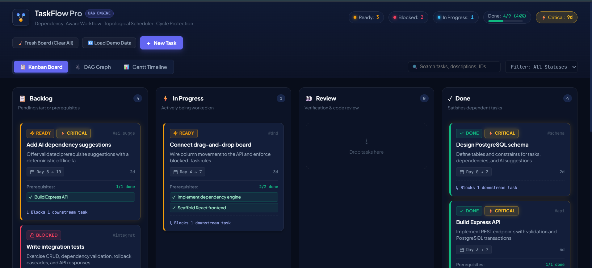
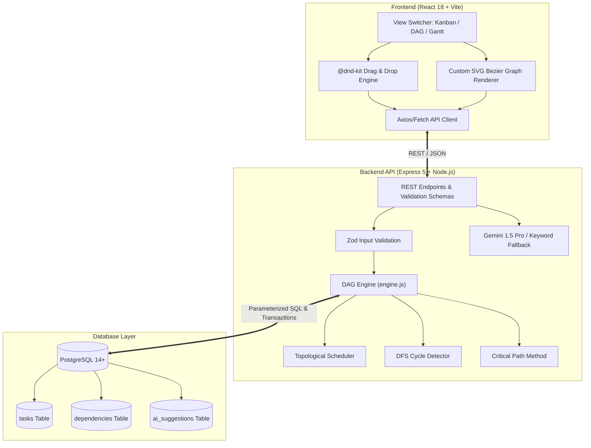

# ⚡ TaskFlow Pro — Dependency-Aware DAG Kanban & Timeline Engine

[](https://github.com/maharshi027/taskflow-pro)
[](https://taskflow-pro.vercel.app)
[](https://taskflow-pro-1-z3zn.onrender.com/health)
[](https://www.postgresql.org/)
[](https://nodejs.org/)
[](https://react.dev/)

> **A next-generation, graph-powered project management platform built for CONTATA Hackathon 2026.**  
> While standard Kanban boards treat tasks as isolated cards, **TaskFlow Pro** models workflows as a **Directed Acyclic Graph (DAG)**. Tasks respect prerequisites, cycle creation is strictly rejected before persistence, schedules dynamically propagate across downstream dependents, and blocked states cascade in real time.

---

> [!IMPORTANT]
> ### 🌐 Live Deployment & Cold Start Notice (Unpaid Cloud Hosting)
> This project is **fully deployed and operational on live cloud infrastructure**:
> - **Frontend**: Deployed on **[Vercel](https://taskflow-pro.vercel.app)**
> - **Backend API**: Deployed on **[Render](https://taskflow-pro-1-z3zn.onrender.com)** *(Free Instance Tier)*
> - **Database**: Hosted PostgreSQL on Render
> 
> ⏳ **Render Free-Tier Spin-Up Note**:  
> Because the backend is hosted on Render's free tier, the server instance automatically spins down (enters sleep mode) after a period of inactivity.  
> - **On first access or initial load, please allow 30–60 seconds or refresh the page 2–3 times** to wake up the backend container and establish the database connection.
> - Once the service is awake, **the application operates with lightning-fast real-time responsiveness** across all views, drag-and-drop operations, and graph calculations!

---

## 📑 Table of Contents

- [The Core Innovation](#-the-core-innovation)
- [Visual Product Tour](#-visual-product-tour)
  - [1. Dependency-Aware Kanban Board](#1-dependency-aware-kanban-board)
  - [2. Interactive DAG Dependency Graph](#2-interactive-dag-dependency-graph)
  - [3. Dynamic Gantt Timeline Visualizer](#3-dynamic-gantt-timeline-visualizer)
- [Key Engineering Features](#-key-engineering-features)
- [System Architecture & Data Flow](#-system-architecture--data-flow)
- [Benchmark Workflow (Seed Scenario)](#-benchmark-workflow-seed-scenario)
- [REST API Specification](#-rest-api-specification)
- [Local Setup & Installation](#-local-setup--installation)
- [Automated Testing](#-automated-testing)
- [Tech Stack](#-tech-stack)
- [CONTATA Hackathon 2026 Declaration](#-contata-hackathon-2026-declaration)

---

## 💡 The Core Innovation

In standard project management tools (Trello, standard Jira boards), nothing stops a developer from moving a task to *In Progress* or *Done* even when its foundational prerequisites haven't even started. This causes phantom progress, misaligned sprint expectations, and costly blocker surprises.

**TaskFlow Pro solves this through mathematical graph theory:**

1. **Topological Scheduling Engine**: Computes start and end offsets automatically. If task $B$ depends on task $A$, $B$'s earliest start date is mathematically guaranteed to be $\ge \text{endDate}(A)$.
2. **Strict Cycle Detection**: Prevents deadlock dependencies ($A \to B \to C \to A$) via Depth-First Search (DFS) cycle validation *before* saving to PostgreSQL.
3. **Cascading State Machine**: If an upstream dependency is incomplete, downstream tasks are automatically branded as **🔒 Blocked** with explanatory badges. Moving a prerequisite back to backlog instantly re-locks its dependents.
4. **Critical Path Method (CPM)**: Instantly identifies the longest sequential chain of dependencies that dictates the minimum project delivery timeline.
5. **AI-Assisted Prerequisite Discovery**: Leverages Google Gemini (with an offline keyword-matching fallback) to analyze task titles/descriptions and recommend prerequisite relationships.

---

## 📸 Visual Product Tour

### 1. Dependency-Aware Kanban Board
> Real-time workflow across **Backlog**, **In Progress**, **Review**, and **Done** with dynamic drag-and-drop powered by `@dnd-kit`.



- **Live Status Badges**: Tasks display computed statuses (`READY`, `BLOCKED`, `CRITICAL`, `DONE`) based on real-time dependency satisfaction.
- **Prerequisite Progress Tracking**: Every card displays a clear breakdown (e.g., `1/1 done`, `2/2 done`) and lists blocking upstream tasks.
- **Downstream Impact Indicators**: Informs engineers of consequences before moving tasks (e.g., `↳ Blocks 1 downstream task`).
- **Real-Time KPIs**: Top metric bar tracks ready tasks, blocked bottlenecks, in-progress items, overall completion percentage, and total critical path duration.

---

### 2. Interactive DAG Dependency Graph
> A custom SVG-rendered directed acyclic graph visualizer mapping all project relationships into sequential execution tiers.


- **Tiered Topological Layout**: Automatically organizes tasks into sequential execution tiers (Tier 0 to Tier 3) from left to right.
- **Glowing Critical Path Highlighting**: Click the **Highlight Critical Path** toggle to illuminate the exact bottleneck sequence in glowing gold.
- **Interactive Path Tracing**: Hover over any node to highlight its entire upstream lineage (prerequisites in blue) and downstream impact (dependents in purple).
- **Smooth Bezier Connectors**: Clean SVG cubic Bezier curves with directional arrowheads eliminate visual clutter.

---

### 3. Dynamic Gantt Timeline Visualizer
> Chronological day-by-day Gantt timeline demonstrating schedule propagation and converging paths.


- **Converging Path Resolution (DAG Max)**: When a task depends on multiple prerequisites, its timeline bar automatically aligns to $\max(\text{prerequisite end dates})$.
- **Critical Path Glow**: Bottleneck tasks are framed in glowing golden borders so team leads immediately spot schedule risks.
- **Day-by-Day Grid**: Visualizes integer day offsets ($Day\;0 \to Day\;14$) with duration chips and prerequisite counters.

---

## ⚙️ Key Engineering Features

| Feature | Technical Implementation | Benefit |
| :--- | :--- | :--- |
| **Topological Sort** | In-degree queue + adjacency list propagation | Instant $O(V + E)$ date recalculation across entire project |
| **Cycle Prevention** | DFS recursive cycle checking with node-color tracking | Eliminates circular deadlocks with HTTP 422 before database writes |
| **Atomic Transactions** | PostgreSQL `BEGIN ... COMMIT` with rollback protection | Guarantees database state remains pristine if any cascade or validation fails |
| **Cascade Status Guard** | Real-time status evaluator | Moving a task backwards instantly re-blocks all downstream dependents |
| **Smart AI Suggestions** | Google Gemini API + offline NLP keyword-overlap fallback | Intelligently recommends logical prerequisites during task creation |
| **Safe Cross-Origin API** | Configured Express CORS with sanitization | Protects against unsafe browser ports and malicious origins |

---

## 🏗 System Architecture & Data Flow



---

## 📊 Benchmark Workflow (Seed Scenario)

TaskFlow Pro includes a pre-packaged benchmark dataset replicating a real-world software engineering release cycle (9 tasks, 9 dependencies, converging diamond workflow):

```text
               ┌────────────────────────┐
               │ Design Postgres Schema │ (Day 0-2) [DONE]
               └───────────┬────────────┘
                           │
            ┌──────────────┴──────────────┐
            ▼                             ▼
┌────────────────────────┐   ┌──────────────────────────┐
│   Build Express API    │   │  Scaffold React Frontend │ (Day 0-2) [DONE]
│  (Day 3-7) [DONE] ★   │   └─────────────┬────────────┘
└───────────┬────────────┘                 │
            │          ┌───────────────────┘
            │          ▼
            │   ┌─────────────────────────────┐
            │   │ Implement Dependency Engine │ (Day 0-3) [DONE]
            │   └──────────────┬──────────────┘
            │                  │
            ├──────────────────┼────────────────────────┐
            │                  ▼                        ▼
            │   ┌───────────────────────────┐   ┌─────────────────────────┐
            │   │ Connect Drag-and-Drop Bd  │   │   Show Critical Path    │
            │   │ (Day 4-7) [IN PROGRESS]   │   │   (Day 4-5) [READY]     │
            │   └──────────────┬────────────┘   └─────────────────────────┘
            │                  │
            ▼                  ▼
┌─────────────────────────┐   ┌─────────────────────────────┐
│ Add AI Dep Suggestions  │   │  Write Integration Tests    │
│  (Day 8-10) [READY] ★   │   │  (Day 8-10) [BLOCKED]       │
└───────────┬─────────────┘   └──────────────┬──────────────┘
            │                                │
            └────────────────┬───────────────┘
                             ▼
               ┌────────────────────────┐
               │  Deploy and Document   │ (Day 11-12) [BLOCKED] ★
               └────────────────────────┘
```
*(★ Indicates tasks on the 9-day Critical Path)*

---

## 📡 REST API Specification

| Method | Endpoint | Description |
| :--- | :--- | :--- |
| `GET` | `/health` | Database connection status and health probe |
| `GET` | `/board` | Fetch full board with dynamically computed dates, statuses, and dependencies |
| `POST` | `/board/reset-seed` | Reset board state to the 9-task diamond benchmark dataset |
| `POST` | `/board/clear` | Wipe all tasks and dependencies for a clean production board |
| `GET` | `/critical-path` | Retrieve longest bottleneck dependency chain and total duration |
| `POST` | `/tasks` | Create a new task with title, description, and planned duration |
| `PATCH` | `/tasks/:id` | Update task details with automatic schedule re-propagation |
| `DELETE` | `/tasks/:id` | Delete task (`?cascade=true` to unlink downstream dependencies safely) |
| `POST` | `/tasks/:id/move` | Move task across columns with validation and automatic rollback on block violations |
| `POST` | `/dependencies` | Create a new dependency edge (strictly rejects cycles and self-links) |
| `DELETE` | `/dependencies/:taskId/:prereqId` | Remove a dependency link and recompute schedule |
| `POST` | `/ai/suggest-dependencies` | Request AI-generated prerequisite recommendations |
| `POST` | `/ai/suggestions/:id/decide` | Accept or reject an AI prerequisite suggestion |

---

## 🚀 Local Setup & Installation

### Prerequisites
- **Node.js**: v20.0.0 or higher
- **npm**: v9.0.0 or higher
- **PostgreSQL**: v14.0 or higher (running locally or in Docker)

---

### Step 1: Clone Repository
```bash
git clone https://github.com/maharshi027/taskflow-pro.git
cd taskflow-pro
```

<<<<<<< HEAD
The API runs at `http://localhost:5000`. The server creates its tables on startup. The seed command creates **9 realistic tasks** and **9 dependency relationships**, including converging dependency paths.
=======
---
>>>>>>> readme-update

### Step 2: Configure & Start Backend

1. Navigate to backend directory:
   ```bash
   cd backend
   npm install
   ```

2. Create `.env` file from example:
   ```env
   PORT=5000
   DB_HOST=localhost
   DB_PORT=5432
   DB_NAME=taskflow
   DB_USER=postgres
   DB_PASSWORD=your_postgres_password
   FRONTEND_ORIGIN=http://localhost:5173
   GEMINI_API_KEY=your_gemini_api_key_optional
   ```

3. Initialize PostgreSQL Database:
   ```sql
   CREATE DATABASE taskflow;
   ```

4. Populate benchmark dataset & start server:
   ```bash
   npm run seed
   npm run dev
   ```
   *The backend API will start on **`http://localhost:5000`** with tables initialized automatically.*

---

### Step 3: Configure & Start Frontend

1. In a new terminal, navigate to frontend directory:
   ```bash
   cd frontend
   npm install
   ```

2. Create `.env` file:
   ```env
   VITE_API_URL=http://localhost:5000
   ```

3. Launch Vite development server:
   ```bash
   npm run dev
   ```
   *Open **`http://localhost:5173`** in your browser.*

---

## 🧪 Automated Testing

The backend includes a dedicated unit and integration testing suite verifying:
- **Diamond Graph Scheduling**: Correct start and end date calculation with multi-prerequisite convergence.
- **Transitive Blocking**: Ensures downstream tasks cannot transition to in-progress when prerequisites are incomplete.
- **Cycle Rejection**: Validates that circular dependency insertion attempts return HTTP 422 without corrupting state.

Run the test suite:
```bash
cd backend
npm test
```

---

## 💻 Tech Stack

<<<<<<< HEAD
| Method | Path                                    | Purpose                                                        |
| ------ | --------------------------------------- | -------------------------------------------------------------- |
| GET    | `/health`                               | Database-backed health check                                   |
| GET    | `/board`                                | Full board with computed dates and statuses                    |
| POST   | `/board/reset-seed`                     | Reset board to 9 benchmark tasks & DAG edges                   |
| POST   | `/board/clear`                          | Wipe all tasks & dependencies for a clean production board     |
| GET    | `/critical-path`                        | Longest dependency chain & duration                            |
| POST   | `/tasks`                                | Create a task                                                  |
| PATCH  | `/tasks/:id`                            | Update task details (title, dates, duration, description)      |
| DELETE | `/tasks/:id`                            | Delete task (`?cascade=true` to unlink downstream tasks)       |
| POST   | `/tasks/:id/move`                       | Move a task between columns (with automatic rollback reblock)  |
| POST   | `/dependencies`                         | Add a cycle-safe dependency                                    |
| DELETE | `/dependencies/:taskId/:prerequisiteId` | Remove a dependency                                            |
| POST   | `/ai/suggest-dependencies`              | Get validated suggestions (Gemini or offline keyword fallback) |
| POST   | `/ai/suggestions/:id/decide`            | Accept or reject a suggestion                                  |
=======
- **Frontend**:
  - React 18
  - Vite
  - `@dnd-kit/core` & `@dnd-kit/sortable` (Accessible drag-and-drop)
  - Custom SVG Path Visualizers (Cubic Bezier curve generation)
  - CSS Custom Properties & Responsive Glassmorphic Design System
- **Backend**:
  - Node.js & Express 5
  - Zod (Runtime input validation)
  - Pure JavaScript Topological & Critical Path Graph Engine
- **Database**:
  - PostgreSQL 14+
  - `pg` Connection Pool with atomic transaction runner (`withTransaction`)
- **Cloud & Deployment**:
  - Frontend: Vercel Static Hosting
  - Backend: Render Web Services
  - Database: Render Managed PostgreSQL
- **AI Integration**:
  - Google Gemini 1.5 Pro / Flash API
  - Deterministic NLP keyword-overlap fallback for offline resilience
>>>>>>> readme-update

---

## 🏆 CONTATA Hackathon 2026 Declaration

<<<<<<< HEAD
The application provides three interactive views accessible from the top navigation bar:

- **Kanban Board**: Drag-and-drop workflow across Backlog, In Progress, Review, and Done with live status badges (`Ready`, `Blocked`, `Done`), prerequisite breakdowns (`✓ Complete`, `🔒 Blocking`), downstream impact indicators, and real-time search and status filtering.
- **DAG Dependency Graph**: Interactive directed acyclic graph visualizer showing sequential execution tiers, smooth Bezier curves, arrowheads, glowing Critical Path edges, and hover path-tracing to clearly inspect upstream prerequisites and downstream dependents.
- **Gantt Timeline**: Chronological day-by-day Gantt view that visually demonstrates schedule propagation, converging paths (DAG max scheduling), and critical path duration.
=======
This project was engineered and submitted for **CONTATA Hackathon 2026**.
>>>>>>> readme-update

- **Focus**: Algorithmic project management, dependency graph intelligence, and intuitive UX.
- **Codebase**: Built with clean architecture, separated concerns (pure graph engine, REST routing, transactional data persistence), and zero third-party UI framework bloat.
- **Live Testing**: The live demo is fully accessible and seeded for evaluation. *(Please remember to allow 30–60s on the first request for the free-tier Render server to wake up).*

---

<<<<<<< HEAD
## Key Assumptions

- This sprint supports one shared board and does not include authentication or per-user workspaces.
- Dependencies are finish-to-start only: a prerequisite must be Done before its dependent can proceed.
- Dates are integer day offsets, not calendar dates, and do not account for weekends or holidays.
- The frontend and backend are deployed separately when hosted; `FRONTEND_ORIGIN` controls CORS.

## Limitations

- There is no real-time synchronization or conflict-resolution layer for simultaneous edits.
- The in-memory AI rate limiter resets when the server restarts and is not suitable for multi-instance scaling.
- The offline AI fallback is keyword-based and less capable than an LLM.
- No authentication, authorization, audit history, file attachments, or notification system is included.
- A live deployment URL is not included in this repository; deployment requires a hosted PostgreSQL database and Node service configuration.

## Project structure

```text
taskflow-pro/
├── backend/
│   ├── config/
│   │   └── db.js                 # PostgreSQL pool, schema initialization, and transaction runner
│   ├── src/
│   │   ├── engine.js             # Pure DAG algorithms (topological scheduling, cycle detection, critical path)
│   │   ├── seed.js               # 9-task diamond workflow benchmark seeder
│   │   └── server.js             # Express 5 API, validation schemas, AI integration, and routes
│   ├── test-engine.mjs           # Node test runner suite (diamond scheduling, cycle rejection, rollback)
│   ├── nodemon.json              # Development reload configuration
│   ├── package.json              # Backend dependencies and scripts (dev, start, seed, test)
│   └── .env.example              # Sample backend environment variables template
├── frontend/
│   ├── src/
│   │   ├── components/
│   │   │   ├── Board.jsx         # Kanban drag-and-drop board with search/status filters
│   │   │   ├── BoardColumn.jsx   # Droppable status columns with drop indicators & empty state
│   │   │   ├── SchematicView.jsx # Interactive SVG DAG dependency graph with hover path-tracing
│   │   │   ├── TaskCard.jsx      # Draggable card with status pills, prerequisite chips & critical badges
│   │   │   ├── TaskModal.jsx     # Task edit/create modal with cascade-delete prompt & dependency manager
│   │   │   ├── TimelineView.jsx  # Day-by-day Gantt timeline showing converging paths & critical path
│   │   │   ├── TitleBlock.jsx    # Navigation header with live KPI metrics, view switcher & action CTAs
│   │   │   └── Toast.jsx         # Non-blocking top-right notification toasts
│   │   ├── api.js                # Frontend REST API client
│   │   ├── App.jsx               # Root application state, view routing, and confirmation modals
│   │   ├── app.css               # Comprehensive design system, dark theme tokens, and animations
│   │   ├── theme.css             # Supplementary theme variables and utility classes
│   │   └── main.jsx              # React DOM entry point
│   ├── index.html                # HTML entry point with modern typography
│   ├── package.json              # Frontend dependencies (@dnd-kit, vite, react)
│   ├── vite.config.js            # Vite build and dev server configuration
│   └── .env.example              # Frontend environment variables template
├── .gitignore                    # Git ignore rules for node_modules, build artifacts, and env files
└── README.md                     # Architecture, API specifications, and setup instructions
```

## GitHub and deployment

The repository includes `render.yaml` for a separated Render deployment. It creates a Node web service from `backend/`, a static site from `frontend/`, and a PostgreSQL database. If configuring services manually, use these settings:

- Backend root directory: `backend`
- Backend build command: `npm ci`
- Backend start command: `npm start`
- Backend health check path: `/health`
- Frontend root directory: `frontend`
- Frontend build command: `npm ci && npm run build`
- Frontend publish directory: `dist`

Set `DATABASE_URL` from the Render PostgreSQL service, `FRONTEND_ORIGIN` to the deployed frontend URL, and `VITE_API_URL` to the deployed backend URL. Run `npm run seed` once from the backend service shell against the production database before sharing the frontend URL. Do not use `yarn` or `npm install` as the backend start command.
=======
*Crafted with precision for CONTATA Hackathon 2026 by the TaskFlow Pro Team.*
>>>>>>> readme-update
